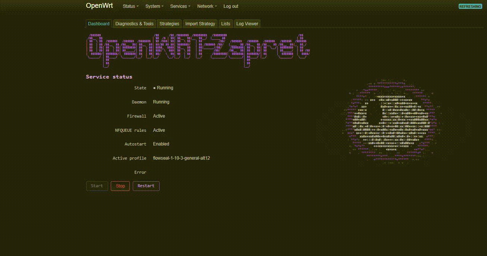

<h1 align="center">OpenWRT-Zapret</h1>

<p align="center"><strong>Расширение LuCI для настройки и управления обходом DPI на OpenWrt.</strong></p>

<p align="center">Управление сервисом, стратегиями, тестированием и сетевыми списками — из веб-интерфейса маршрутизатора.</p>

<p align="center">
  
  
  
  
  
</p>

<p align="center"></p>

<p align="center">
  <a href="https://github.com/senaKash/OpenWRT-Zapret/releases"><strong>Релизы</strong></a> ·
  <a href="#-документация"><strong>Документация</strong></a> ·
  <a href="https://github.com/senaKash/OpenWRT-Zapret/issues"><strong>Сообщить о проблеме</strong></a>
</p>

---

## ✨ Возможности

| Раздел | Что доступно |
| :-- | :-- |
| 🟦 **Dashboard** | Состояние сервиса, активный профиль, **Start / Stop / Restart** |
| 🟪 **Strategies** | Выбор и применение стратегий, **Test / Test All**, результаты проверок |
| 🟨 **Update Strategies** | Обновление стратегий с отображением этапов и **прогресса** |
| 🟩 **Import Strategy** | Импорт поддерживаемых `general*.bat` **без запуска BAT-файлов** |
| 🟧 **Lists** | Домены, IP-адреса, пользовательские списки и исключения |
| ⬜ **Diagnostics / Log Viewer** | Диагностика сервиса и просмотр журналов |

> [!TIP]
> **Тестирование без ручной смены настроек.** На время проверки стратегия активируется на маршрутизаторе, после чего предусмотрено восстановление предыдущей конфигурации.
>
> Результаты теста с роутера могут отличаться от поведения устройств в локальной сети.

---

## 📦 Установка

**Проверенная конфигурация:**

| Устройство | Прошивка | Архитектура | Пакет |
| :-- | :-- | :-- | :-- |
| **Xiaomi AX3000T v2** | OpenWrt SNAPSHOT | `aarch64_cortex-a53` | `apk` |

> [!IMPORTANT]
> **Сверяйте архитектуру и зависимости с вашей прошивкой.** Текущий APK проверен на устройстве выше; совместимость с другими моделями пока не подтверждена. Для модулей ядра важна также совместимость ABI.

**1.** Возьмите файл `openwrtzapret-0.9.20260307-r2.apk` на странице [**Releases**](https://github.com/senaKash/OpenWRT-Zapret/releases).

**2.** Отправьте APK на роутер **с компьютера**:

```sh
scp -O openwrtzapret-0.9.20260307-r2.apk root@192.168.1.1:/tmp/openwrtzapret.apk
```

**3.** Подключитесь по SSH и установите пакет **на роутере**:

```sh
ssh root@192.168.1.1
apk add --allow-untrusted /tmp/openwrtzapret.apk
```

**4.** Откройте **LuCI → Services → OpenWRTZapret**.

> [!NOTE]
> `192.168.1.1` — пример адреса роутера. Для установки недостающих зависимостей нужен доступ к совместимым репозиториям OpenWrt.

<details>
<summary><b>🔄 Обновление установленной версии</b></summary>

После передачи нового APK в `/tmp/openwrtzapret.apk` выполните:

```sh
apk add --allow-untrusted --upgrade /tmp/openwrtzapret.apk
```

Если репозитории временно недоступны, **а все зависимости уже установлены**:

```sh
apk add --repositories-file /dev/null --allow-untrusted --upgrade /tmp/openwrtzapret.apk
```

Обновите страницу LuCI без кеша (`Ctrl + F5`).

</details>

<details>
<summary><b>⚠️ Переход с отдельных zapret2 и luci-app-zapret2</b></summary>

Единый пакет **конфликтует** с отдельно установленными `zapret2` и `luci-app-zapret2`.

**Сначала сохраните конфигурацию и пользовательские стратегии.** Проверьте, что будет удалено:

```sh
apk del --simulate luci-app-zapret2 zapret2
```

Если список удаления проверен и необходимые зависимости доступны, удалите старые пакеты:

```sh
apk del luci-app-zapret2 zapret2
```

Затем установите `openwrtzapret.apk` по инструкции выше. **Не используйте `--force`** для обхода конфликтов и несовместимости зависимостей.

</details>

---

## 🛠️ Сборка из исходников

<details>
<summary><b>Показать инструкцию для OpenWrt buildroot</b></summary>

Используйте buildroot, настроенный под целевую систему. Добавьте feed в `feeds.conf`:

```text
src-git openwrtzapret https://github.com/senaKash/OpenWRT-Zapret.git;openwrtzapret
```

В корне buildroot:

```sh
./scripts/feeds update openwrtzapret
./scripts/feeds install -p openwrtzapret openwrtzapret
make menuconfig
```

Выберите пакет **`openwrtzapret`** в режиме модуля (`M`), затем выполните:

```sh
make package/feeds/openwrtzapret/openwrtzapret/compile V=s -j1
```

Результат: `bin/packages/<architecture>/openwrtzapret/openwrtzapret-*.apk`.

</details>

## 📚 Документация

| Тема | Ссылка |
| :-- | :-- |
| Архитектура | [docs/architecture.md](docs/architecture.md) |
| Тестирование стратегий | [docs/testing.md](docs/testing.md) |
| Формат профилей | [docs/profile-format.md](docs/profile-format.md) |
| Импорт стратегий | [docs/flowseal-import.md](docs/flowseal-import.md) |

---

## ⚖️ Компоненты и лицензии

Для обработки трафика используется [Zapret2](https://github.com/bol-van/zapret2) (`nfqws2`). Поддерживается импорт стратегий из [zapret-discord-youtube](https://github.com/Flowseal/zapret-discord-youtube). Эти проекты развиваются независимо от OpenWRTZapret.

**Лицензия OpenWRTZapret:** [MIT](LICENSE) · **Лицензии сторонних компонентов:** [THIRD_PARTY_NOTICES.md](THIRD_PARTY_NOTICES.md)
